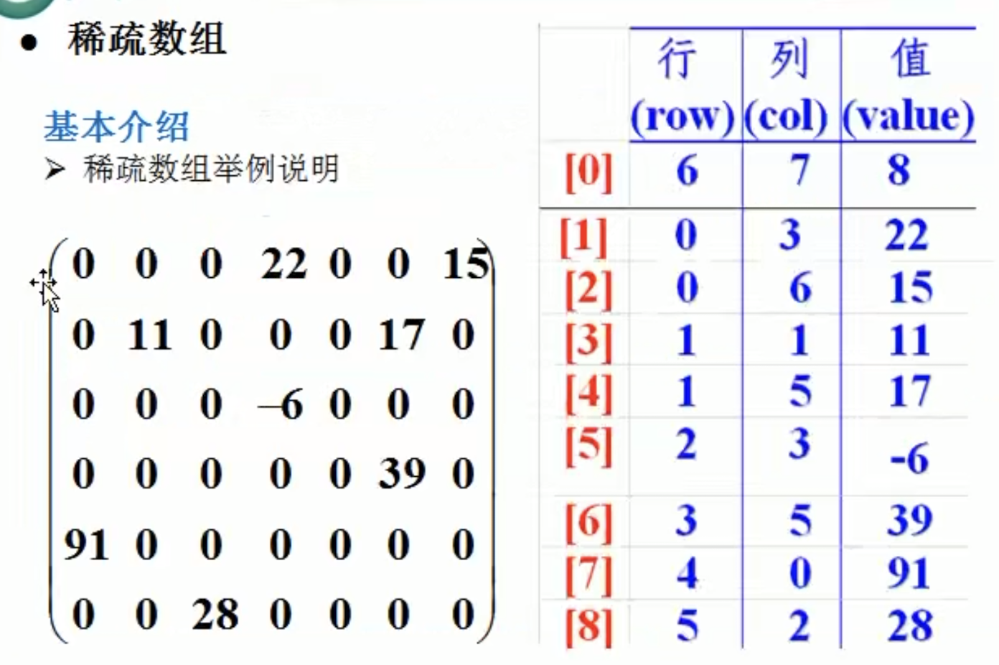

# Sparse Array
Imagine a 2D int array storing few data and a lot of 0, which are meaningless as default values but still take memory spaces. 
Great memory waste right? Sparse array can do the compress job and help you save space.

### How sparse array work
Sparse array is an alternative way of storing an array, usually used when an array stores a lot of 0 or other repeating values.

The sparse array records 2 things:
* number of rows, columns and valid (non-0) values
* row & col of each non-zero values

An example is:

While the original array on the left takes 42 cells, the sparse array on the right takes 27.

### How to convert to sparse array
1. Traverse through the original array to get total number of valid data `sum`. Size of sparse array is immutable so this is required to calculate how many rows and cols are needed.

2. Then you can create the sparse array, which should have `sum + 1` rows, with an extra top row storing total rows, cols and number of values. Dimension of the array varies number of cols, for 2D array it should be 3.

3. Now store the values with corresponding rows and cols into the sparse array.

### How to convert back
1. Read top row of the sparse array to get number of rows and cols of the original array.

2. Create the array using the given size and fill with the default value.

3. Read other rows and assign values to cells.
